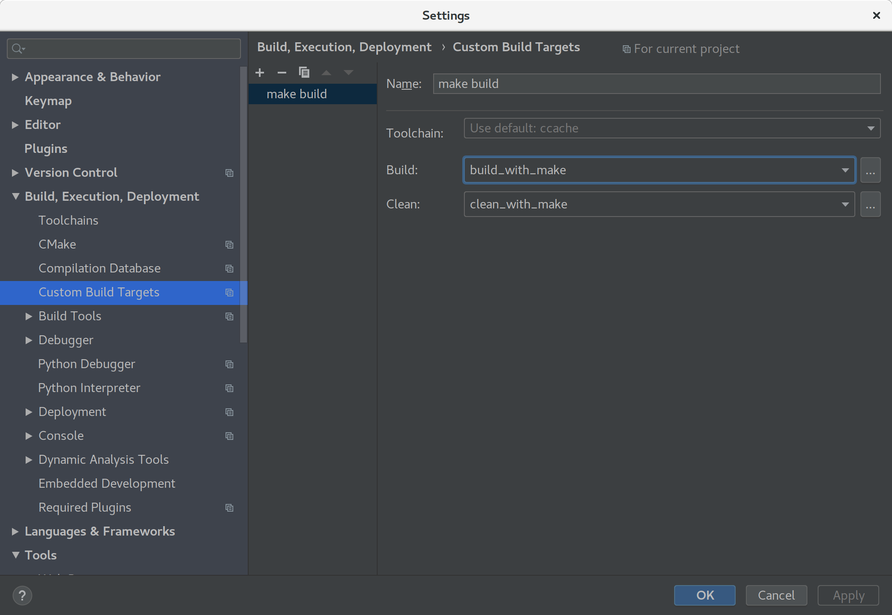
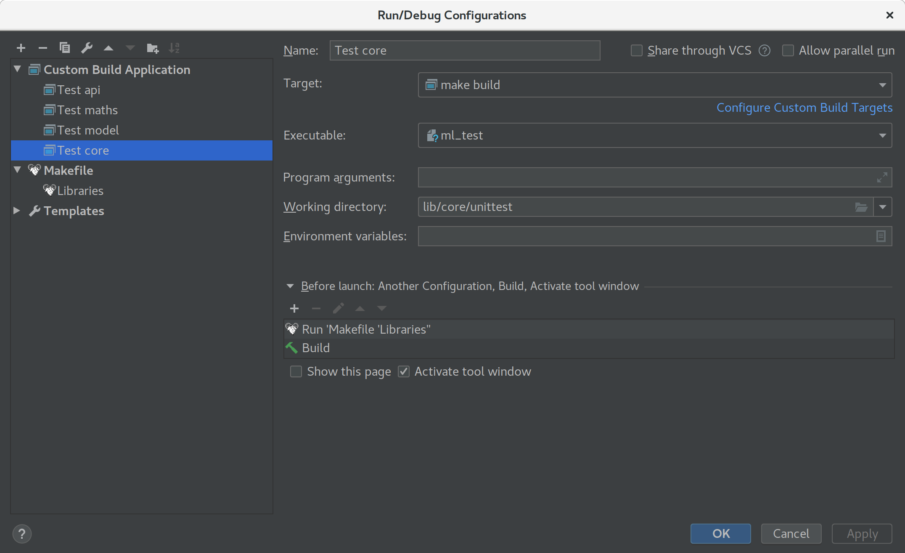

# Using CLion with `ml-cpp`

CLion 2018.2 has added support for the compilation database project format. This tutorial shows how to create a
compilation database for the `ml-cpp` project and integrate it with CLion.

## Installing prerequisites

Note: this tutorial assumes that you have installed the correct version of GCC ([Linux](../linux.md))
or XCode command line tools ([macOS](../macos.md)) installed on your system and it can be accessed
by simply calling `g++` or `clang++`.

### CLion

For testing and evaluation purposes you can use [30-day trial version of CLion](https://www.jetbrains.com/clion) or
participate on the [CLion early access program](https://www.jetbrains.com/clion/nextversion/).

You need to install the current [CLion](https://www.jetbrains.com/clion/) (version 2018.2 or later) with the following
plugins:
* Compilation Database
* File Watchers
* Makefile support

You can install the plugins either during the initialization dialog, when you first start CLion, or later using the menu
**Settings / Preferences | Plugins**.

### Compilation database

Install Python module [compiledb](https://github.com/nickdiego/compiledb) from PyPi:
```
pip install compiledb
```

It is better to install the module on the system level, since it will create an executable `compiledb`, which can be
easier integrated into CLion.


##  Create compilation database and load it in CLion

This section took a lot of information from CLion help page [Managing Makefile
projects](https://www.jetbrains.com/help/clion/managing-makefile-projects.html). Please, refer this page for
additional instruction and screenshots. For more information on using compilation database in CLion, see [JetBrains
CLion Help page](https://www.jetbrains.com/help/clion/compilation-database.html)

To create the compilation database file `compile_commands.json` in your project, simply call
```
compiledb -n make -j
```
from the project root directory. 

The argument `-n` will avoid the complete build of the targets (which somewhat accelerates the process), while
all arguments after `make` will simply be passed to the `make` command. 

To add unittests files to the compilation database, you need to go to the directories of the individual unit tests, e.g.
`lib/core/unittest` and run 
```
compiledb -o ../../../compile_commands.json -n make -j
``` 

New files are usually **added** to `compile_commands.json` unless you additionally specify `-f` for override.

If the command runs suspiciously quickly and the `compile_commands.json` file is empty, this means that your project is
already built and `make` didn't do anything. Simply run `make clean` before running `compiledb`.

Now, in CLion navigate to **File | Open** on the main menu and choose the `compile_commands.json` file or a directory
that contains it and click **Open as Project**. All files and symbols processed during the run of `compiledb make` are
visible and accessible from CLion.

You can enable automatic reload of the project for every change in `compile_commands.json` by setting th **Use
auto-import** checkbox in **Settings / Preferences | Build, Execution, Deployment | Compilation Database**.

To follow up the changes in the Makefiles, we can create File Watchers (you should have installed File Watchers plugin).
Navigate to **Settings / Preferences | Tools | File Watchers** and create a new File Watcher for all files of type **GNU
Makefile** located in the project root and subdirectories:
 
**File type:** GNU Makefile\
**Scope:** Project Files\
**Program:** `compiledb`\
**Arguments:** `-n -o $ProjectFileDir$/compile_commands.json make -j`\
**Working directory:** `$ProjectFileDir$`
- [x] Auto-save edited files to trigger the watcher
- [x] Trigger the watcher on external changes


## Create custom build targets for building and testing

Compilation database itself lacks the data required for **building, running and debugging** an application. However, you
can set up the workflow by adding **custom build targets** for your compilation database project and creating custom
**Run/Debug configurations** for these targets.

### Custom build targets

Let's create a custom target to build the libraries, which gives you the same behavior as running `make` in the
project root. Go to **Settings / Preference | Build, Execution, Deployment | Custom Build Targets** and click **+** to
add a new target. Pick the name, in this tutorial we will use the name *make build*.

In the area **Toolchain** we have to specify custom tools for building and cleaning the project. 

For **Build:** click on **...** to open **External Tools** window and then on **+** to create a new external tool. 

In the window **Edit Tool** specify:

**Name:** build_with_make\
**Program:** `make`\
**Arguments:** `-j`\
**Working directory:** `$ProjectFileDir$`\
**Advanced Options**
- [x] Synchronize files after execution\
- [x] Open console for tool output


Similarly, for **Clean:** create a new external tool with the following entries in the **Edit Tool** window:

**Name:** clean_with_make
**Program:** `make`\
**Arguments:** `clean`\
**Working directory:** `$ProjectFileDir$`\
**Advanced Options**
- [x] Synchronize files after execution\
- [x] Open console for tool output

Once you are done, your **Custom Build Targets** window should look similar to this: 



### Run/Debug Configuration

Once we created the custom build target, we can use it to build projects and run/debug unit tests withing IDE.

Let's go to menu **Run | Edit Configurations...** and click on **+** to create a new configuration. 

Since we installed **Makefile support** plugin, we can add **Makefile** configuration to build the complete project:

**Name:** `Libraries`\
**Makefile:** Makefile\
**Arguments:** `-j ML_DEBUG=1`
- [x] Allow parallel run

I assume that you want to build the project with debug symbols activated, but, obviously, you need to remove the
argument `ML_DUBUG=1` if you don't. Leave the field **Working Directory** empty, as it will be correctly set elsewhere.

It is important that you specify the environment variable `CPP_SRC_HOME`. If you specified it on the system
level, CLion can pick it up automatically, otherwise you have to specify it explicitly in the **Environment variables**
field. Click on the document symbol :page_facing_up: on the right of the field and either make sure that the checkbox
**Include system environment variables** is activated and your environment variables are listed in the list below, or
add them to the list **User environment variables** manually.

You can now build the project manually by selecting the configuration `Libraries` from the configurations drop-down menu
and clicking the green play button. Moreover, we will create a configuration for running unit tests and use `Libraries`
as a build dependency so we ensure that the project is up-to-date every time we run those tests.

Let's create another **Run/Debug Configuration** for running uni tests for the `core` module. Again, go to **Run | Edit
Configurations...** and click on the **+** symbol to create a new **Custom Build Application**:

**Name:** Test core\
**Target:** *Select the custom build target `make build` that we created before*

**Executable:** *Navigate to `lib/core/unittest/` and select the `ml_test` binary*\
If you cannot find the executable `ml-test`, then you don't have one yet. Simply, build the unittests by executing 
`make` in the `lib/core/unittest` directory once to create it.

**Working directory:** `lib/core/unittest`

In the area **Before launch: Another Configuration, Build, Activate tool window** click on **+** and select **Run
another configuration** and then **Libraries**. Make sure it is run before **Build** by using up- and down-arrows.



If you want to run an individual test suite or a test case, you can specify those in the field **Program
arguments**.

Now, you can run and debug your code by selecting the appropriate configuration and using **play** or **debug** symbols.

For more information and useful screenshots, please refer to the [Clion help page on custom build
targets](https://www.jetbrains.com/help/clion/custom-build-targets.html). Here you can also find more information on
[Creating new Run/Debug Configurations](https://www.jetbrains.com/help/clion/run-debug-configuration.html) as well as
[running](https://www.jetbrains.com/help/clion/running-applications.html) and
[debugging](https://www.jetbrains.com/help/clion/debugging-code.html) your code.
