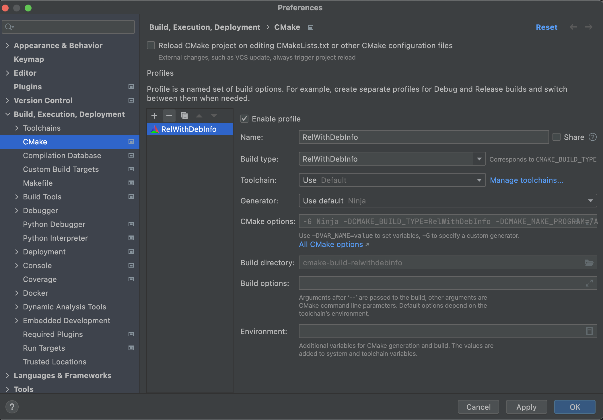
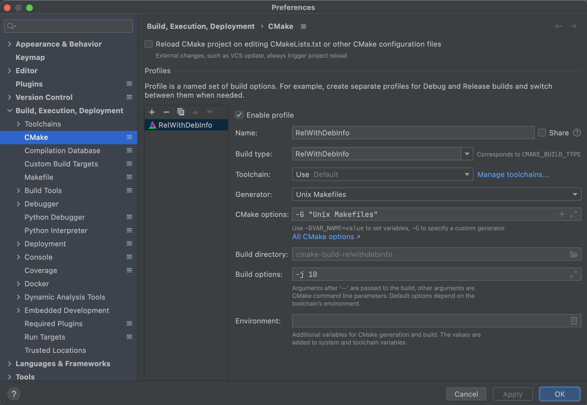

# Using CLion with `ml-cpp`

Previous versions of `ml-cpp` provided instructions on how to configure `CLion` using a compilation database format or 
a Makefile project. Those methods of integrating `CLion` with the `ml-cpp` repository have now been superseded by
creating a `CMake` project. Before proceeding further delete any pre-existing `.idea` directory from the root of
your `ml-cpp` repository.

## Installing prerequisites

Note: this tutorial assumes that you have installed the correct version of GCC ([Linux](../linux.md))
or XCode command line tools ([macOS](../macos.md)) installed on your system and it can be accessed
by simply calling `g++` or `clang++`.

### CLion

For testing and evaluation purposes you can use [30-day trial version of CLion](https://www.jetbrains.com/clion) or
participate on the [CLion early access program](https://www.jetbrains.com/clion/nextversion/).

You need to install the current [CLion](https://www.jetbrains.com/clion/) (version 2021.3.4 or later) with the
`File Watcher` plugin.

You can install plugins either during the initialization dialog, when you first start CLion, or later using the menu
**Settings / Preferences | Plugins**.


## Importing the `ml-cpp` project

Open `CLion` and close any existing open project. From the `Welcome to CLion` screen click on `Open` and navigate to
your `ml-cpp` repo. 


Ensure `CMake project` is selected and click the `OK` button. You will be presented with the `CLion` preferences
for the `ml-cpp` project.



By default `CLion` will opt for generating a `Ninja` build system. While this is a perfectly valid option, for
better compatibility with building from the command line it is preferred to configure `CLion` to generate
`Unix Makefiles`. To do this either select `Unix Makefiles` from the `Generator` drop-down or type 
`-G "Unix Makefiles"` in the`CMake options` field. Add  e.g. `-j 10` to the `Build options` field, select your
desired build type (e.g.`Release` or `Debug`) and we're done. Make sure to leave the `Build directory` field
blank as CLion will automatically determine it based on the build type selected. 
(You may need to set the `CPP_SRC_HOME`environment variable in the`Environment` field if this is missing or 
incorrect in your environment).




### Run/Debug Configuration

`CLion` integrates so closely with `CMake` projects that there should be no need for any further configuration
to enable `Run` or `Debug` targets.

However, one common thing you may want to do is to run an individual test suite or a test case, to do this you
can click on `Edit Configurations` in the drop-down for targets, select the `Boost.test` that you're
interested in and specify any options to the test  in the field **Program arguments**.


Of course, in the instance of wanting to run an individual test suite or case it is always possible to do this directly
in the IDE. Navigate to the test source file in question and click the green "play" button in the gutter next to the
suite or test case name and select the desired option, e.g.


### Integration with `clang-format`

Recent versions of CLion come with integrated support for `clang-format`. To ensure that `clang-format` is used
in preference to the built-in formatter navigate to Navigate to **Settings / Preferences | Tools | clang-format** and
ensure that **Clang-format binary** is set to `clang-format` and that the **PATH** field is empty. Then navigate to
**Settings / Preferences | Editor | Code Style** and tick **Enable ClangFormat with clangd server**.

Alternatively, you may wish to set up a File Watcher to invoke `clang-format` from
**Settings / Preferences | Tools | File Watchers**

**File type:** C/C++\
**Scope:** Project Files\
**Program:** `clang-format`\
**Arguments:** `-i $FileName$`\
**Output paths to refresh:** `$FileName$`\
**Working directory** `$FileDir`
- [x] Auto-save edited files to trigger the watcher
- [x] Trigger the watcher on external changes

### Integration with `valgrind`

Clion has full support for running and analyzing code using the `valgrind` suite.
Valgrind is readily available on most linux distributions but on macOS an experimental build is required
```
brew install --HEAD https://raw.githubusercontent.com/sowson/valgrind/master/valgrind.rb
```

Once installed go to **Settings / Preference | Build, Execution, Deployment | Dynamic Analysis Tools | Valgrind**
and specify the full path to the `valgrind` executable. In the `Analysis options` field you may wish to add e.g.
```
--leak-check=full --leak-resolution=med --track-origins=yes --vgdb=no
```
Valgrind` can now be used to analyze `run` configurations from
**Run | Run *Run Configuration* with Valgrind Memcheck**


For more information and useful screenshots regarding running and debugging, please refer to the following resources:
[running](https://www.jetbrains.com/help/clion/running-applications.html) and
[debugging](https://www.jetbrains.com/help/clion/debugging-code.html) your code.
