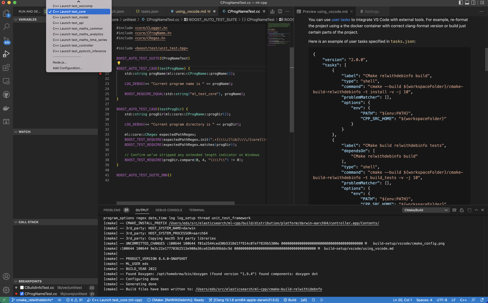

# Using Visual Studio Code with `ml-cpp`

As an alternative to [CLion](../clion/using_clion.md), `VSCode` offers support
for `CMake` projects by way of an extension, while still being able to provide features like autocompletion,
code navigation, static code analysis, etc. 

## Prerequisites

In this tutorial, we assume that you have `gcc` or `clang` installed as described in the
[CLion tutorial](../clion/using_clion.md). 
and
[Visual Studio Code](https://code.visualstudio.com/) with
[cmake plugin](https://marketplace.visualstudio.com/items?itemName=twxs.cmake),
[cmake tools plugin](https://marketplace.visualstudio.com/items?itemName=ms-vscode.cmake-tools),
[C/C++ plugin](https://marketplace.visualstudio.com/items?itemName=ms-vscode.cpptools)
as a minimum.

In **Settings**, make sure *C_Cpp:Autocomplete* and *C_Cpp:Intelli Sense Engine* from the native C++ plugin of VS Code
are disabled. Note that we don't want to disable the complete C/C++ Extension, since we are still going to use the
debugging capabilities.

Now for the `CMake` plugin, change the `Build directory` specified in **Settings** > **Extensions** >
**CMake Tools** to read `${workspaceFolder}/cmake-build-relwithdebinfo` (preferred) or `${workspaceFolder}/cmake-build-debug`,
depending on the build variant that you can select in the side panel at the bottom of the editor window.
You may also wish to set certain environment variables for the build.
To do so, under `Cmake: Build Environment` click the `Add item`
button and add the variable definition. The other settings can be left as-is.


## User tasks

You can use [user tasks](https://code.visualstudio.com/docs/editor/tasks) to integrate VS Code with external tools. For
example, re-format the project using a the docker container with correct clang-format version or build just certain parts of
the project.

Here is an example of user tasks specified in `tasks.json`:

```json
{
	"version": "2.0.0",
	"tasks": [
		{
			"label": "CMake relwithdebinfo build",
			"type": "shell",
			"command": "cmake --build ${workspaceFolder}/cmake-build-relwithdebinfo -t install -v -j 10",
			"problemMatcher": [],
			"options": {
				"env": {
					"PATH": "${env:PATH}",
					"CPP_SRC_HOME": "${workspaceFolder}"
				}
			}
		},
		{
			"label": "CMake build relwithdebinfo tests",
			"dependsOn": [
				"CMake relwithdebinfo build"
			],
			"type": "shell",
			"command": "cmake --build ${workspaceFolder}/cmake-build-relwithdebinfo -t build_tests -v -j 10",
			"problemMatcher": [],
			"options": {
				"env": {
					"PATH": "${env:PATH}",
					"CPP_SRC_HOME": "${workspaceFolder}"
				}
			},
			"group": {
				"kind": "build",
				"isDefault": true
			}
		},
		{
			"label": "CMake build relwithdebinfo test_core",
			"dependsOn": [
				"CMake relwithdebinfo build"
			],
			"type": "shell",
			"command": "cmake --build ${workspaceFolder}/cmake-build-relwithdebinfo -t ml_test_core -v -j 10",
			"problemMatcher": [],
			"options": {
				"env": {
					"PATH": "${env:PATH}",
					"CPP_SRC_HOME": "${workspaceFolder}"
				}
			},
			"group": {
				"kind": "build",
				"isDefault": true
			}
		}
	]
}
```

## Debugging

To use [debugging](https://code.visualstudio.com/docs/editor/debugging), you need to specify the binary and the
arguments in a json file. You can use `preLaunchTask` to specify the user tasks that should be executed before the start
(e.g. building project).

Here is an example of the `launch.json` file. Please update the fields for `targetArchitecture` and `MIMode` to values appropriate for your development platform.

```json
{
  "configurations": [
    {
      "name": "C++ Launch test_ver",
      "type": "cppdbg",
      "targetArchitecture": "arm64",
      "request": "launch",
      "program": "${workspaceFolder}/cmake-build-relwithdebinfo/test/lib/ver/unittest/ml_test_ver",
      "cwd": "${workspaceRoot}/lib/ver/unittest/",
      "stopAtEntry": false,
      "MIMode": "lldb"
    },
    {
      "name": "C++ Launch test_seccomp",
      "type": "cppdbg",
      "targetArchitecture": "arm64",
      "request": "launch",
      "program": "${workspaceFolder}/cmake-build-relwithdebinfo/test/lib/seccomp/unittest/ml_test_seccomp",
      "cwd": "${workspaceRoot}/lib/seeccomp/unittest/",
      "stopAtEntry": false,
      "MIMode": "lldb"
    },
    {
      "name": "C++ Launch test_core",
      "type": "cppdbg",
      "targetArchitecture": "arm64",
      "request": "launch",
      "program": "${workspaceFolder}/cmake-build-relwithdebinfo/test/lib/core/unittest/ml_test_core",
      "args": ["--run_test=CProgNameTest/testProgName"],
      "cwd": "${workspaceRoot}/lib/core/unittest/",
      "stopAtEntry": false,
      "MIMode": "lldb"
    },
    {
      "name": "C++ Launch test_model",
      "type": "cppdbg",
      "targetArchitecture": "arm64",
      "request": "launch",
      "program": "${workspaceFolder}/cmake-build-relwithdebinfo/test/lib/model/unittest/ml_test_model",
      "cwd": "${workspaceRoot}/lib/model/unittest/",
      "stopAtEntry": false,
      "MIMode": "lldb"
    },
    {
      "name": "C++ Launch test_api",
      "type": "cppdbg",
      "targetArchitecture": "arm64",
      "request": "launch",
      "program": "${workspaceFolder}/cmake-build-relwithdebinfo/test/lib/api/unittest/ml_test_api",
      "cwd": "${workspaceRoot}/lib/api/unittest/",
      "stopAtEntry": false,
      "MIMode": "lldb"
    },
    {
      "name": "C++ Launch test_maths_common",
      "type": "cppdbg",
      "targetArchitecture": "arm64",
      "request": "launch",
      "program": "${workspaceFolder}/cmake-build-relwithdebinfo/test/lib/maths/common/unittest/ml_test_maths_common",
      "cwd": "${workspaceRoot}/lib/maths/common/unittest/",
      "stopAtEntry": false,
      "MIMode": "lldb"
    },
    {
      "name": "C++ Launch test_maths_analytics",
      "type": "cppdbg",
      "targetArchitecture": "arm64",
      "request": "launch",
      "program": "${workspaceFolder}/cmake-build-relwithdebinfo/test/lib/maths/analytics/unittest/ml_test_maths_analytics",
      "cwd": "${workspaceRoot}/lib/maths/analytics/unittest/",
      "stopAtEntry": false,
      "MIMode": "lldb"
    },
    {
      "name": "C++ Launch test_maths_time_series",
      "type": "cppdbg",
      "targetArchitecture": "arm64",
      "request": "launch",
      "program": "${workspaceFolder}/cmake-build-relwithdebinfo/test/lib/maths/time_series/unittest/ml_test_maths_time_series",
      "cwd": "${workspaceRoot}/lib/maths/time_series/unittest/",
      "stopAtEntry": false,
      "MIMode": "lldb"
    },
    {
      "name": "C++ Launch test_controller",
      "type": "cppdbg",
      "targetArchitecture": "arm64",
      "request": "launch",
      "program": "${workspaceFolder}/cmake-build-relwithdebinfo/test/bin/controller/unittest/ml_test_controller",
      "cwd": "${workspaceRoot}/bin/controller/unittest/",
      "stopAtEntry": false,
      "MIMode": "lldb"
    },
    {
      "name": "C++ Launch test_pytorch_inference",
      "type": "cppdbg",
      "targetArchitecture": "arm64",
      "request": "launch",
      "program": "${workspaceFolder}/cmake-build-relwithdebinfo/test/bin/pytorch_inference/unittest/ml_test_pytorch_inference",
      "cwd": "${workspaceRoot}/bin/pytorch_inference/unittest/",
      "stopAtEntry": false,
      "MIMode": "lldb"
    }
  ]
}
```

To run testsuites for a specific library click on the `Run and Debug` tab in the left handle panel and then select the desired `C++ launch` target from dropdown at the top of the `Run and Debug` panel, e.g.



To run a specific unit test add the test class/test name in the `args` field:
```json
            "args": [
                "--run_test=CProgNameTest/testProgName"
            ],
```

